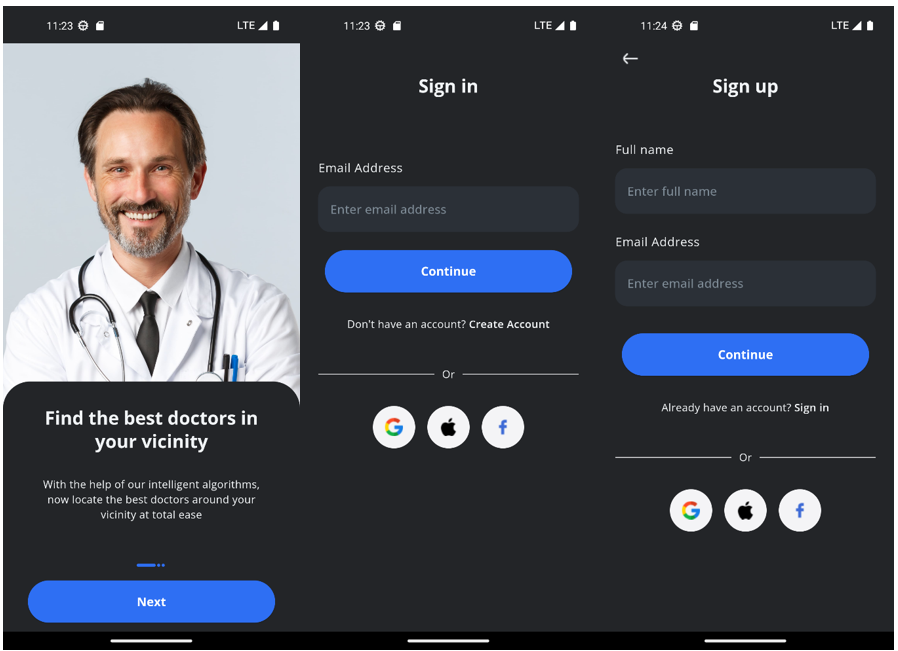
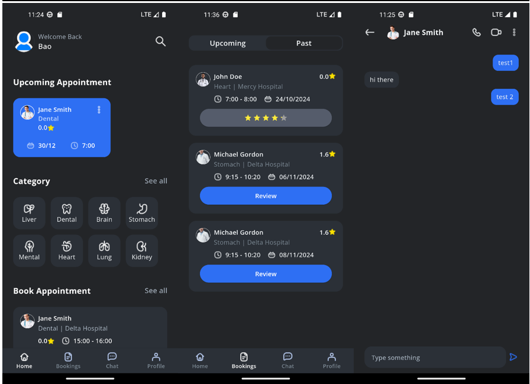
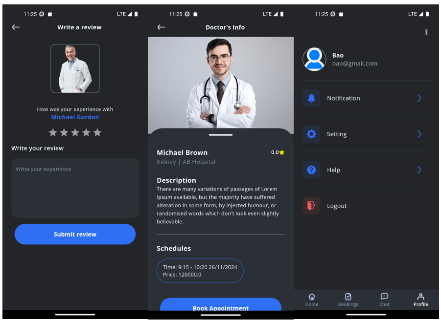

<h1> Doctor Appointment </h1>
<h2> About this project</h2>
<h3> Project overview</h3>

This app is designed to simplify the process of scheduling medical appointments. Users can easily book an appointment with trusted doctors, which brings convenience and saves time.

You can try android app at [here](tmp/app-release.apk)

<h3> Features </h3>

- User Authentication: Login, Signup, Forgot password, Logout
- Appointment:
    - Search available schedules
    - Book an appointment
    - View booking appointment history
    - Write a review for a doctor
- Chat:
    - Chat with doctors

- Appearance: Dark theme and Light theme
    

<h3> Used tech stack </h3>

- Architechture: MVVM
- Database: Firebase Realtime database, Firebase Storage
- State Management: BloC, ChangeNotifier
- Libs: Hive (caching data for user), shared_preferences (check first opening app), get_it, dartz, equatable, flutter_native_splash, flutter_pannable_rating_bar

<h3> Expected features in the future </h3>

- Intergrate payment methods
- Voice call and video call

<h3> Some screenshot </h3>

